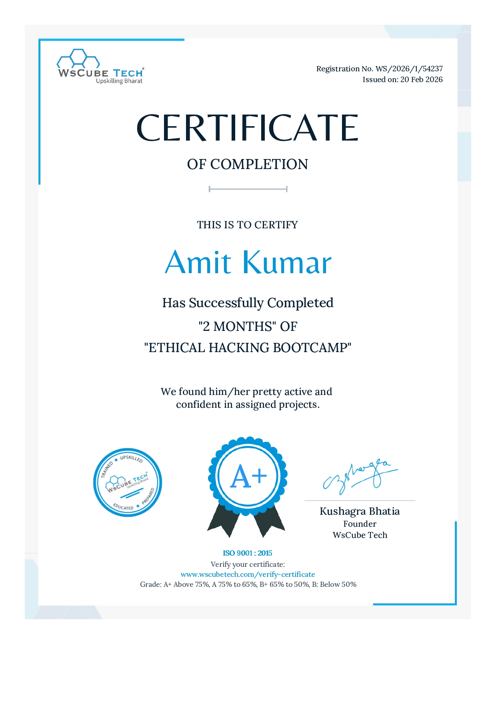

# 🛡️ Cybersecurity Certificate - Infosys Springboard

I have successfully completed a Cybersecurity course from Infosys Springboard 🎉

## 📜 Certificate

## 📚 What I Learned
- Basics of Cybersecurity  
- Types of Cyber Attacks (DoS, Phishing, etc.)  
- Ethical Hacking Introduction  
- Network Security Fundamentals  
- Data Protection  

## 🚀 My Goal
This is the beginning of my journey in Ethical Hacking. I will continue learning and improving my skills.

---
⭐ Feel free to explore my GitHub for more cybersecurity projects!
